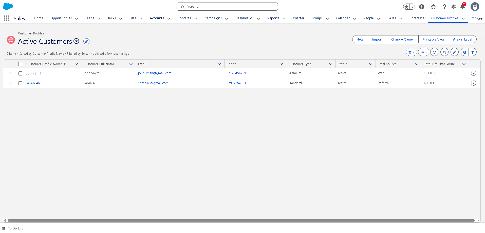
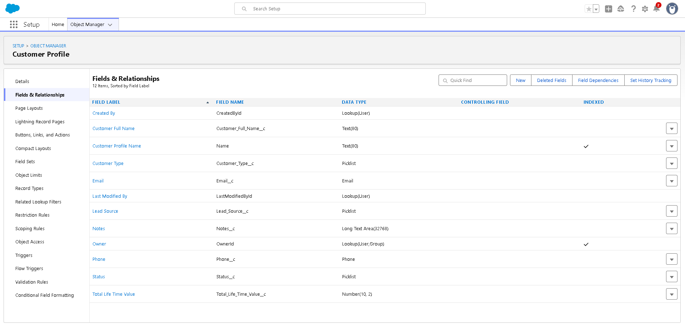
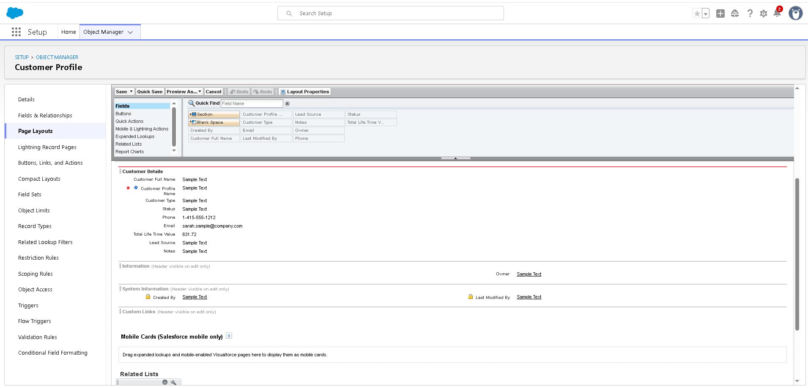
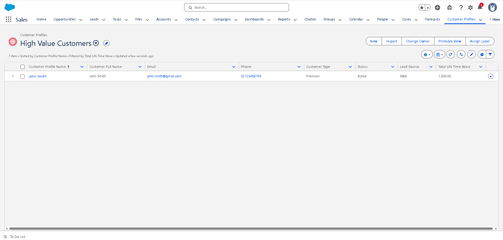
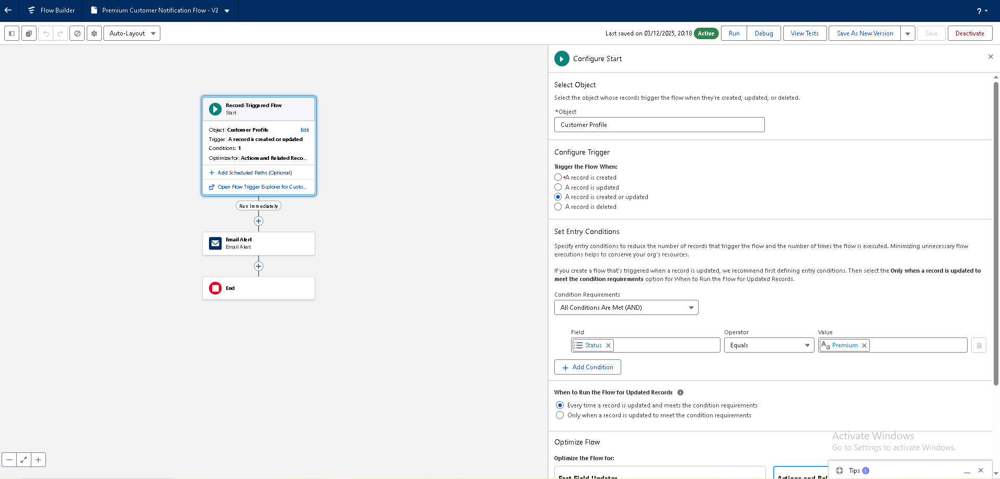
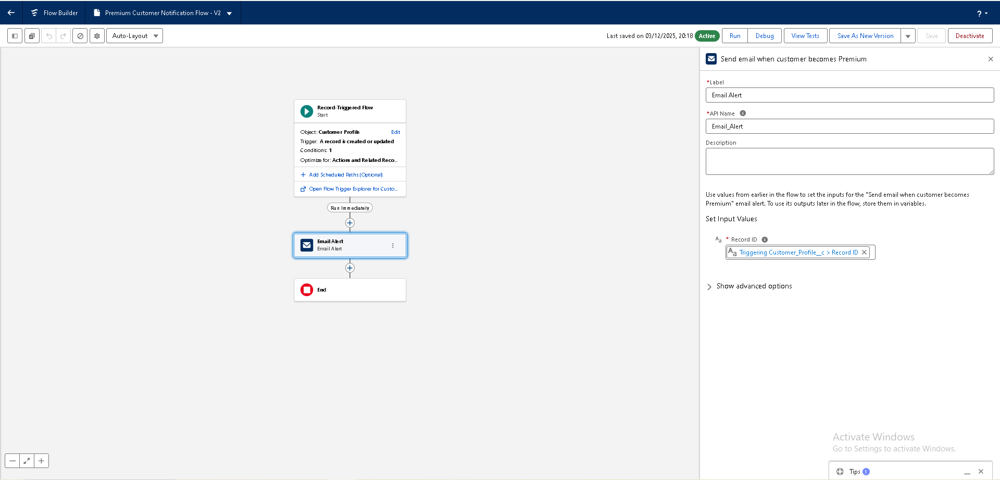
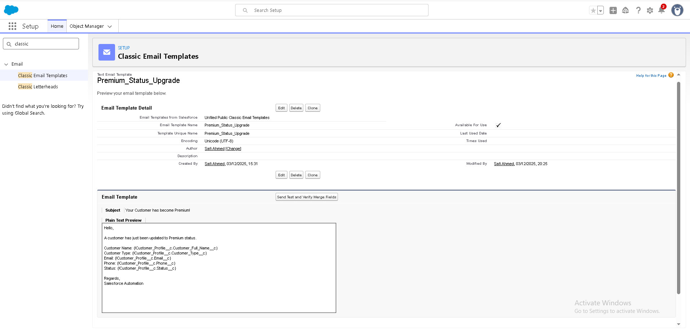
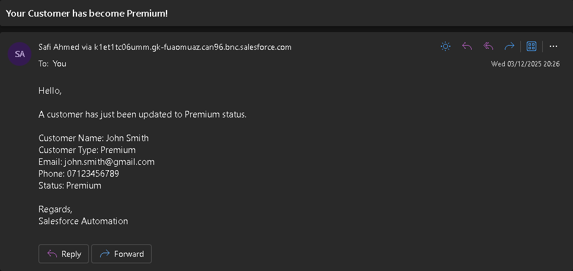

<h1 align="center">Salesforce Mini CRM – Customer Premium Automation</h1>

  A hands-on Salesforce Admin project built inside a Developer Edition Org. 
  Custom Objects • Flow Automation • Email Alerts • List Views • Page Layouts

---

<!-- Badges Row -->

  
  
  
  

---

## 📘 Table of Contents
- [Project Overview](#project-overview)
- [Features](#features)
- [Technical Architecture](#technical-architecture)
- [Tools & Platform](#tools--platform)
- [Skills Demonstrated](#skills-demonstrated)
- [Next Steps](#next-steps)
- [Screenshots](#screenshots)

---

## 🧩 Project Overview

This Mini CRM is built using a **custom Salesforce object** called **Customer Profile**, designed to store customer information and automatically notify the admin when a customer becomes **Premium**.

It demonstrates core Salesforce admin skills:
- Data modelling  
- Page layout design  
- List view customization  
- Record-triggered automation  
- Email alerts + templates  
- Testing flows  

This is built exactly as a real Salesforce Admin would structure a working CRM process.

---

## 🔧 Features

### **1️⃣ Custom Object — Customer Profile**
Includes:
- Customer Full Name  
- Customer Type  
- Email  
- Phone  
- Status  
- Notes  

Designed for clean data entry and downstream automation.

---

### **2️⃣ Page Layout Customization**
- Unnecessary default fields removed  
- Fields grouped logically  
- Single “Customer Details” section  
- Layout optimized for quick scanning  

---

### **3️⃣ Useful List Views**
- **All Customers**  
- **Premium Customers**  
- **Recent Customers**  

Each list view shows:
- Name  
- Email  
- Phone  
- Status  
- Type  
- Created Date  

---

### **4️⃣ Flow Automation — Premium Notification**
A Record-Triggered Flow that:
- Detects when **Status = Premium**
- Sends an **Email Alert** to the admin
- Includes customer details via merge fields

This demonstrates real-world automation used in CRMs.

---

### **5️⃣ Email Template + Alert**
- Classic email template with dynamic merge fields  
- Email alert tied to the flow  
- Sends instantly on status update  

---

## 🔨 Tools & Platform

- Salesforce Lightning  
- Object Manager  
- Flow Builder  
- Email Alerts  
- Classic Email Templates  
- List Views  
- Setup Menu  

---

## 🧠 Skills Demonstrated

- Salesforce Data Modelling  
- Custom Fields & Objects  
- UI & Page Layout Design  
- List View Configurations  
- Flow Automation (Record-Triggered)  
- Email Templates  
- Admin Best Practices  
- Real-world workflow design  

---

## 🚀 Next Steps

- Add Lead → Customer pipeline  
- Add Case Management  
- Add Opportunity tracking  
- Add Validation Rules  
- Add CRM Analytics dashboards  

---

## Screenshots

### Custom Object

### Fields

### Page Layout

### List Views

### Flow Trigger

### Flow Email Alert Action

### Email Template

### Email Received

